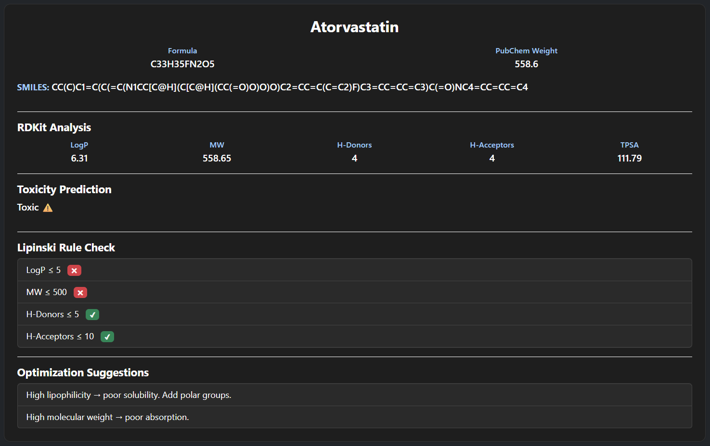

# 🧪 Drug Analysis Platform

A web-based tool to analyze drug molecules using RDKit and PubChem.

---

## 🚀 Live Demo
https://drug-analyzer.onrender.com

---

## 🔬 Features

- Fetch drug data from PubChem  
- Calculate molecular properties (LogP, MW, H-bond donors/acceptors, TPSA)  
- Lipinski Rule of Five evaluation  
- Toxicity prediction  
- 3D molecular visualization  

---

## 🛠 Tech Stack

- Python (Flask)  
- RDKit  
- JavaScript  
- Bootstrap  
- 3Dmol.js  

---

## 📸 Screenshots

### 3D Visualization

### Analysis Output

---

## ▶️ Run Locally

pip install -r requirements.txt  
python app.py  

---

## 📌 Description

This project simulates a basic drug discovery workflow where a user can input a drug name, retrieve its molecular data, analyze its properties, and evaluate drug-likeness.

---

## 👨‍💻 Author

Abinath
